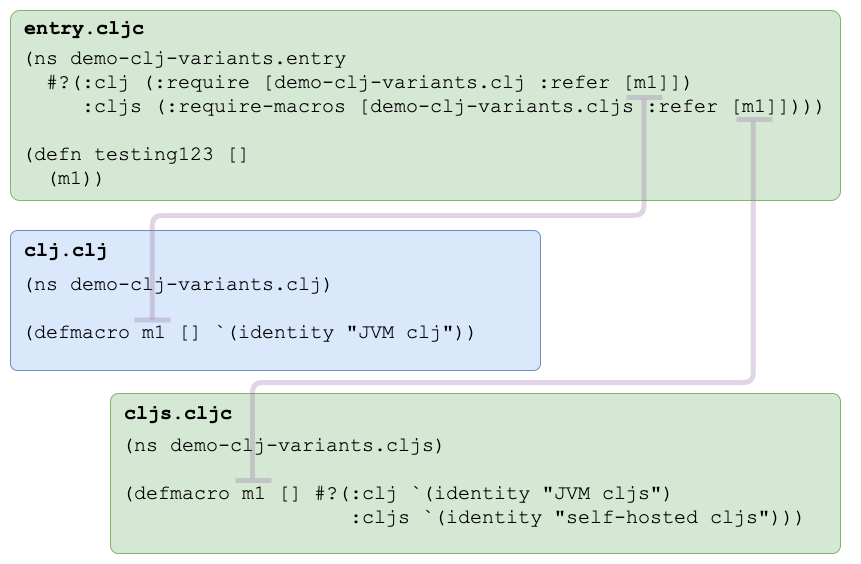

= info-clj-variants
:toc:

== Intro
My little brain does not remember how to write conditional code for JVM cljs vs self-hosted cljs.

This repo is here as a refresher I can come back to and update as I learn more.

Clojure flavors I cover:

* *JVM Clojure* is what you'd expect, just regular old Clojure.
* *Regular ClojureScript* is compiled by the JVM and the one most folks are familiar with.
* *Self-hosted ClojureScript* (aka bootstrap ClojureScript) is ClojureScript compiled by ClojureScript.

As we all know, reader macros can be used to conditionally include code from `.cljc` source for JVM versions of Clojure and ClojureScript:

[source,clojure]
----
#?(:clj "Do this for Clojure"
   :cljs "Do this for ClojureScript")
----

What if we want to target regular vs self-hosted variants of ClojureScript, how do we do that?

To demonstrate one method, this repo has a macro `demo-clj-variants\m1` that will return a different value based what flavor of Clojure it is run on.

Notice that link:src/demo_clj_variants/cljs.cljc[cljs.cljc] is brought in only for `:cljs`. Within that context, `:clj` means regular ClojureScript and
`:cljs` means self-hosted ClojureScript.

I am no authority here, there are likely other ways to distinguish Clojure variants and conditionally include code for those variants,
I just don't know them yet.

Examples were run from bash on macOS.

To run the examples yourself, you'll need https://clojure.org/guides/getting_started[Clojure] and https://github.com/planck-repl/planck#installing[Planck].

== JVM Clojure
[source,bash]
----
$ clojure --eval "(require '[demo-clj-variants.entry :as entry]) (entry/testing123)"
"JVM clj"
----

== Regular ClojureScript
[source,bash]
----
$ clojure --main cljs.main \
          --eval "(require '[demo-clj-variants.entry :as entry]) (entry/testing123)"
"JVM cljs"
----

== Self-hosted ClojureScript
[source,bash]
----
$ planck --classpath src \
         --eval "(require '[demo-clj-variants.entry :as entry]) (entry/testing123)"
"self-hosted cljs"
----

